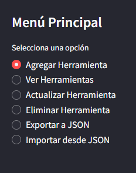
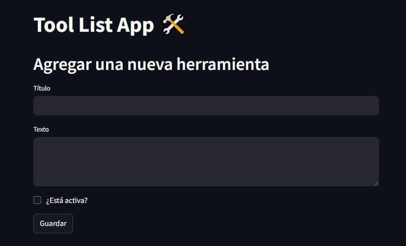
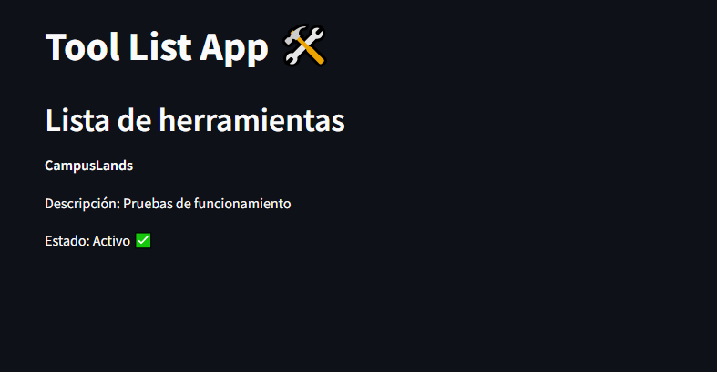
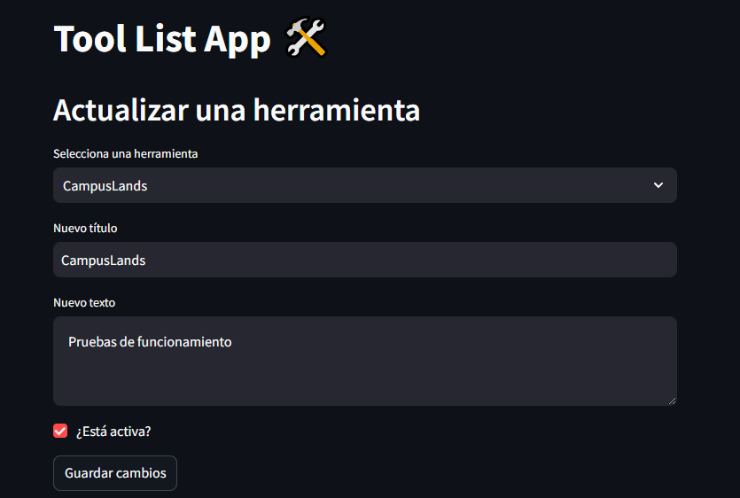
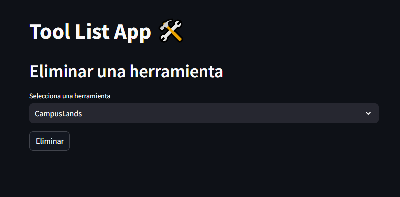
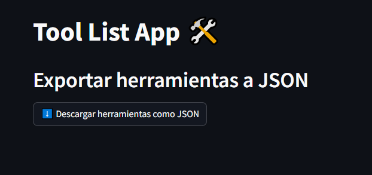
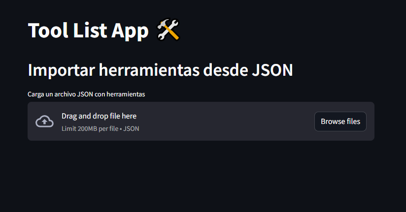

# Tool List App 🛠️

**Tool List App** es una aplicación de lista de tareas (To-Do List) desarrollada en **Streamlit** con gestión de base de datos utilizando **SQLAlchemy**. Permite **agregar**, **visualizar**, **editar**, **eliminar**, e **importar/exportar tareas** en formato JSON.



---

## Tabla de Contenidos 📑
1. [Características](#características)
2. [Requisitos](#requisitos)
3. [Instalación](#instalación)
4. [Ejecución](#ejecución)
5. [Funcionamiento](#funcionamiento)

---

## Características 🎯

- **Agregar** nuevas tareas a la base de datos con título, descripción y estado (activo/inactivo).
- **Visualizar** todas las tareas en una lista detallada.
- **Editar** tareas existentes.
- **Eliminar** tareas.
- **Exportar** tareas a un archivo **JSON**.
- **Importar** tareas desde un archivo **JSON**.
- Interfaz **amigable** y **responsiva** creada con Streamlit.

---

## Requisitos 🛠️

- **Python 3.8+**
- **Streamlit**
- **SQLAlchemy**
- **SQLite** (base de datos embebida)
- Opcional: Editor de texto (VSCode, PyCharm, etc.)

---

## Instalación 🚀

Sigue los siguientes pasos para instalar y ejecutar la aplicación en tu entorno local.

### 1. Clonar el repositorio

```bash
git clone https://github.com/tu-usuario/tool-list-app.git
cd tool-list-app
```
### 2. Crear un entorno virtual
```bash
python -m venv venv

# Activar el entorno virtual en Linux/Mac
source venv/bin/activate

# Activar el entorno virtual en Windows
venv\Scripts\activate
```
### 3. Instalar Dependencias
```bash
streamlit
sqlalchemy
```

---

## Ejecución 🚀

### Para ejecutar la aplicación en Streamlit, usa el siguiente comando:

```bash
streamlit run app.py
```

---

## Funcionalidades ⚙️

### 1. Agregar Tareas 📝  
Permite agregar una nueva tarea completando un formulario:  
- **Título**: Nombre de la herramienta.  
- **Texto**: Descripción de la herramienta.  
- **¿Está activa?**: Checkbox para definir el estado (Activo/Inactivo).



---

### 2. Ver Tareas 📋  
Lista todas las tareas guardadas en la base de datos con sus detalles:  
- **Título**  
- **Descripción**  
- **Estado**: Activo ✅ o Inactivo ❌.



---

### 3. Actualizar Tareas ✏️  
Permite seleccionar una tarea existente, modificar sus campos (Título, Texto, Estado) y guardar los cambios.



---

### 4. Eliminar Tareas 🗑️  
Selecciona una tarea existente y elimínala de la base de datos.



---

### 5. Exportar a JSON 📥  
Exporta todas las tareas en un archivo **JSON** descargable que contiene la información de cada tarea.



---

### 6. Importar desde JSON 📤  
Importa tareas desde un archivo **JSON** previamente estructurado para agregarlas a la base de datos.

